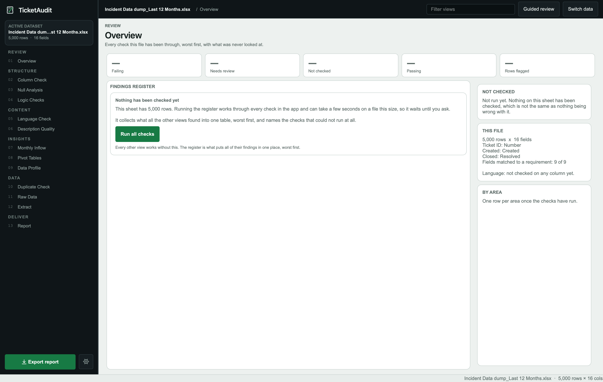
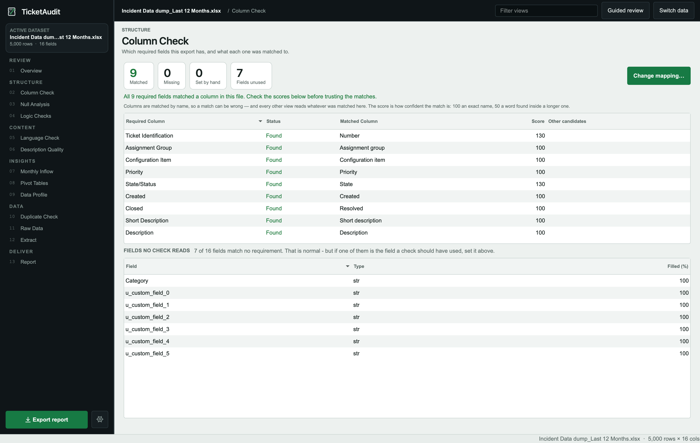
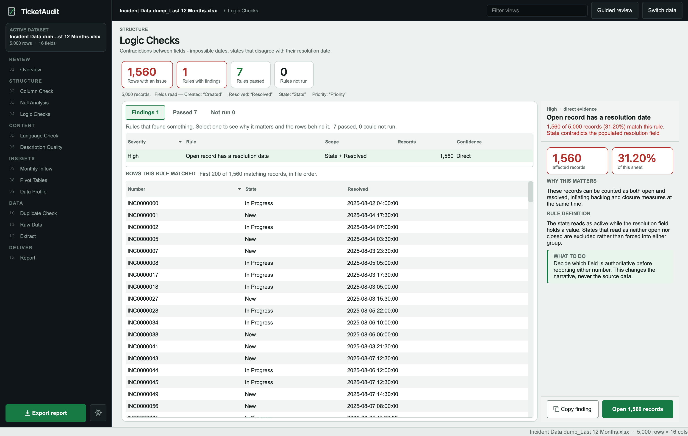
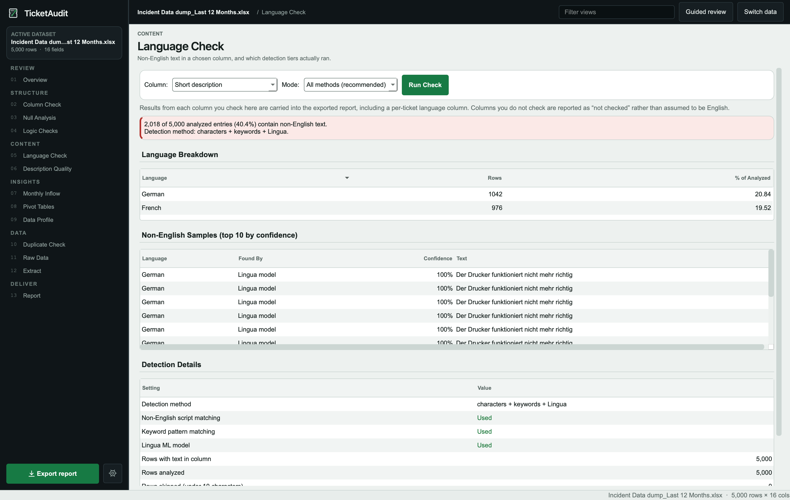
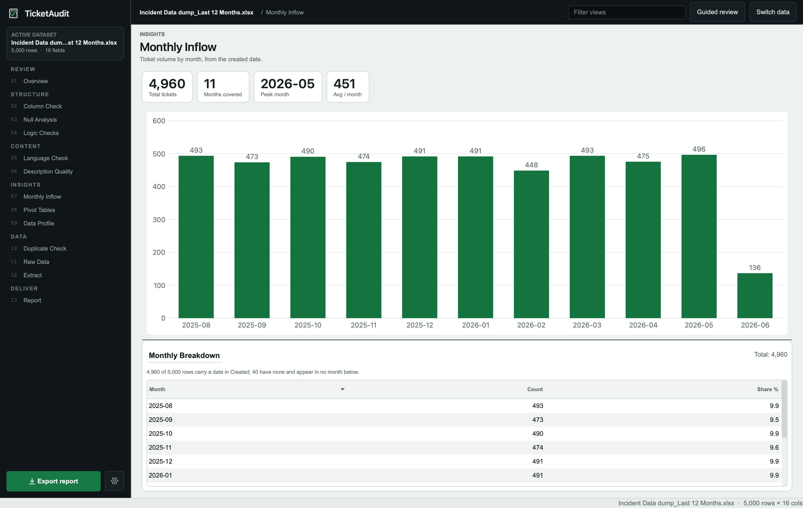
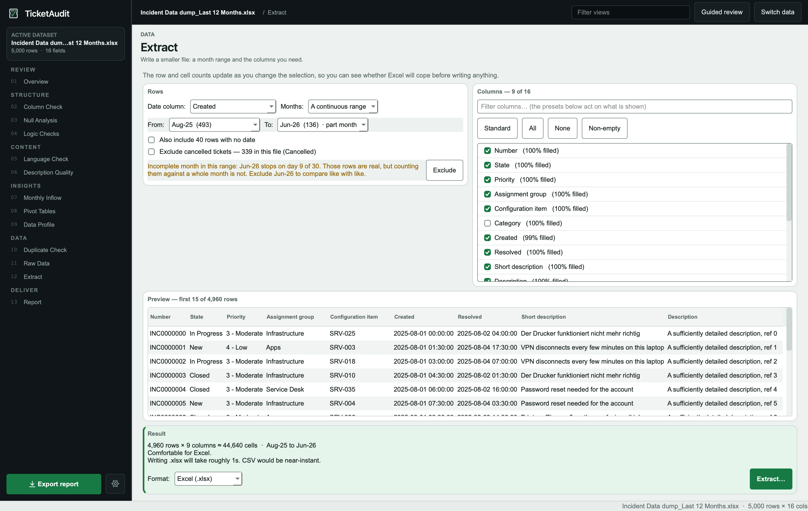

# TicketAudit — Community Edition

<h3 align="center">Know your queue before you report it</h3>

<p align="center">
  <em>An offline desktop tool for auditing ITSM / ServiceNow ticket exports.
  Opens files Excel can't. Finds the problems Excel won't. Hands you a clean extract Excel will.</em>
</p>

<p align="center">
  
  
  
  
</p>

<p align="center">
  Created by <strong>Aneek Hait</strong> —
  <a href="https://aneekhait.github.io">aneekhait.github.io</a> ·
  <a href="https://github.com/AneekHait">github.com/AneekHait</a> ·
  <a href="https://www.linkedin.com/in/aneekhait/">LinkedIn</a>
</p>

---

## The Problem

ServiceNow exports land as Excel files with 100,000–300,000 rows and 25+ columns. Excel opens them — slowly — but can't filter, pivot, or chart them without hanging. So teams either work from samples, or they push the full file into a pivot table and trust that the underlying data is clean.

It often isn't.

**`05/03/2024` can mean 5 March or 3 May.** If pandas guesses wrong and nothing checks it, a 3-day average resolution time gets reported as 92. The data looked fine. Every formula worked. The number was wrong.

That's one class of silent error. There are others:

- Closed tickets with no resolution date (or open ones that already have one)
- High-priority open tickets with no priority value at all
- 63% of description text in French, on a report going to an English-speaking stakeholder
- A "Closd" state sitting in the same column as "Closed" — rare enough that `COUNTIF` never catches it, common enough to skew every closed-ticket metric
- A 230 MB export that stops downloading at 47 MB, opens with a valid header, and reads as empty

TicketAudit catches these before the report goes out.

### What doing this manually looks like

If you tried to cover the same ground in Excel, this is what it takes — on a file large enough that Excel itself is already the first problem:

| Check | Manual approach | Why you'd still miss it |
|---|---|---|
| **Null rates per column** | `=COUNTBLANK()` on each column, one by one | 25 columns × manual formula = skipped after the first five |
| **Duplicate tickets** | `Remove Duplicates` or a `COUNTIF` helper column | Catches exact matches; misses near-duplicates on the ID column |
| **Date format (DD/MM vs MM/DD)** | Spot-check a few cells | Ambiguous dates like `05/03` look correct under either reading — you only find out when a 3-day SLA turns into 92 |
| **Date logic** (resolved before created, future dates) | `=IF(resolved < created, ...)` formula column | Requires knowing which of the 25+ columns are the right date pair. Nulls in either column silently pass the check — `=IF(""<"2024-03-01",...)` evaluates to `FALSE`, not an error, so a ticket with no resolved date looks like it passed |
| **Closed tickets missing a resolution date** | Formula column cross-referencing state and date | Needs a maintained list of every value that counts as "closed" in this org's vocabulary — "Resolved", "Closed", "Completed", "Closed Cancelled" all qualify; an entry you miss silently passes. Each export from a different team may use different values |
| **Open tickets with no priority** | `COUNTIFS` on state + priority | Same vocabulary problem in reverse. "In Progress", "Pending", "Awaiting Info", "On Hold" — which of these count as open? Get one wrong and you're either over-counting or missing the gap entirely |
| **State vocabulary typos** | Pivot table on the state column, scan visually | "Closd" at 0.3% of 150k rows is 450 tickets — two rows in a pivot table you scroll past in a second. TicketAudit flags it because it's one edit away from "Closed" and skews every closed-ticket metric that follows |
| **Non-English descriptions** | No native Excel formula exists for language detection | There is no `=DETECT_LANGUAGE()` in Excel. Without an add-in or API call, you cannot tell whether 3% or 63% of your descriptions are in another language. On a global ServiceNow instance with agents in France, Germany and Japan filing tickets in their own language, that number matters — and there is no manual approach that scales past spot-checking a handful of rows |
| **Recurring / duplicate descriptions** | Sort by description, scan for repeats | An experienced analyst can *estimate* that a queue has recurring issues — "we always get the same VPN complaints". TicketAudit replaces that estimate with a count: *"342 tickets across 7 recurring-issue groups, top group 94 tickets"*, with sample IDs. The analyst's instinct becomes a number they can put in a report and defend |
| **Description length** | `=LEN()` column + conditional format | Flags the cell; still requires reading each flagged row to decide if it's a real issue |
| **Trailing whitespace in a key column** | Nothing — you'd have to suspect it first | `"Closed "` and `"Closed"` look identical in a cell and become **two separate rows** in every pivot table built from that column. Excel gives no indication. You find out when two numbers that should match don't |
| **Which of 25 columns actually hold data** | `COUNTA` per column, or scroll and eyeball | Wide exports carry columns nobody fills. Without a fill rate per column you either keep all 25 or guess which to drop |
| **Truncated / corrupt download** | Open the file and see if it looks right | A file with a valid header and 47 MB of a 230 MB export looks right until you notice the row count |

That's a half-day of formula work on a good day, on a file that may freeze Excel halfway through. And it still misses anything requiring cross-column logic, language awareness, or fuzzy matching.

TicketAudit runs all of it in under 4 seconds on a 100k-row file. Checks that cannot run say so explicitly — they never silently count as a pass.

---

## Screenshots

<p align="center">
  
  <br/><em>Overview — every check as one row, worst first</em>
</p>

<p align="center">
  
  <br/><em>Column Check — match required fields with confidence scores</em>
</p>

<p align="center">
  
  <br/><em>Logic Checks — contradictions between fields, with per-row evidence</em>
</p>

<p align="center">
  
  <br/><em>Language Check — detect non-English text across 33 languages</em>
</p>

<p align="center">
  
  <br/><em>Monthly Inflow — volume trend with part-month warnings</em>
</p>

<p align="center">
  
  <br/><em>Extract — slice by date range and columns, write a file Excel can open</em>
</p>

---

## What It Does

Load an Excel or CSV export. TicketAudit runs nine check views — including eight cross-field logic rules — across the whole file and gives you:

1. **A findings register** — every check as one comparable row, worst first. Checks that could not run say so explicitly; they never silently count as a pass.
2. **An exportable audit workbook** — six-tab Excel report with native PivotTables, dashboard charts, and a per-ticket QA flags sheet.
3. **An extract** — filter to the months and columns you actually need, and write a file Excel can open comfortably.

Everything runs offline. Nothing leaves your machine — which matters when the file is client ticket data.

---

## The Impact Feature: Extract

The single most-used capability on a large file.

A 300,000-row, 23-column ServiceNow export is unworkable in Excel. Extract lets you pick a date column, a month range (or individual months), and the columns worth keeping — and writes just that slice out as `.xlsx` or CSV in under a second for most ranges.

```
400k × 23 file, Feb-2025 → Jul-2026, 7 columns selected:

  Plan (filter)      24 ms
  Build (apply)      15 ms  →  199,129 rows × 7 columns
  Write CSV           0.8 s  →  20.3 MB
  Write .xlsx        24.6 s  →   7.8 MB
```

The result opens instantly in Excel. The original didn't.

**What makes it honest:**
- Part-months are flagged: *"Aug-26 stops on day 12 of 31"* — so a mid-month export doesn't read as a drop in volume
- Undated rows are counted and offered separately, never silently dropped
- Cancelled tickets can be excluded with one tick; the label lists the exact state values it matched
- A provenance sheet (or `.txt` sidecar for CSV) records the date column used, the month range, and what was excluded — because "September's tickets" means different rows depending on whether it was opened or resolved

---

## Performance

Tested on a 300k × 25 file at 35% distinct description text:

| Operation | Time |
|---|---|
| File open (calamine engine) | 8.4 s |
| `SanityAnalyzer` init | 0.2 s |
| Full findings register | 3.7 s |
| Logic Checks (all 8 rules) | ≤ 0.3 s |
| Extract plan + filter | < 50 ms |

The UI stays responsive throughout — heavy work runs on a thread pool; results arrive via Qt signals.

---

## Features & Impact

Thirteen views, grouped in the order you'd actually work through a file. Each one below states what it does and what changes because of it.

### The design spine: "Not checked" is never "Pass"

Every check reports one of **Fail**, **Review**, **Pass**, or **Not checked** — and a check that could not run is *named*, never counted as clean.

This sounds like a detail. It's the most important thing in the tool. A file with no `state` column will happily report "all logic checks passed" in any system that returns a bare count — crediting the data for validation nobody performed. TicketAudit reports which checks it couldn't run and which column would let it.

> **Impact:** you can tell the difference between "this file is clean" and "I didn't look". Everything else in the tool depends on that distinction being visible.

---

### Overview — where you land

The first view, and the only one that answers *"is this file usable?"*. Every check as one comparable row, worst first, with a count of failing checks badged beside each view in the sidebar. Selecting a finding navigates to the view that can act on it. Checks that couldn't run are listed **by name** — because "3 not checked" tells you there's a gap without telling you which one, and the fix differs per check.

It doesn't run automatically, deliberately: the full register costs ~3.7s at 300k rows, and making every file open pay for it whether or not anyone reads it turned a 3.2s load into 6.8s. While idle every tile reads `—`, never `0` — a zero on *Failing* beside a file nothing has looked at is the most misleading thing this view could say.

> **Impact:** you know where to start instead of opening thirteen views to find out. It's the same register as the Excel report's Findings tab, in the same order, so the app and the workbook can never disagree about what outranks what.

---

### Getting the inputs right — before any check runs

**Column Check** — Nine required categories (ID, Created, Closed, State, Priority, Description, Short Description, Assignment, Category) matched with a three-tier scoring system: exact name, word-boundary match, then *value-pattern sampling* — it reads the data, not just the header. 17 ID regexes cover `INC`/`CHG`/`RITM`/`SR`/`PRB`/`TASK`/`CTASK`/`SCTASK` and more. `EXCLUDE_PATTERNS` kills the false positives (it stops `incident_state` matching the ticket-ID category).

Ties are real and common — two columns both scoring 130 is routine, and `sys_updated_on` can outscore `opened_at` for "Created". So every match shows its **score and its runners-up**, and any category can be reassigned or marked genuinely absent.

> **Impact:** every other check reads from this map. A wrong match is normally invisible — you see a confident answer with no way to know it measured `impact` instead of `priority`. Here the score is on screen, the alternatives are one click away, and marking a category absent makes its dependent checks report **Not checked** instead of quietly measuring the wrong field.

**Date field order** — `05/03/2024` is 5 March or 3 May. Pandas guesses, and with nothing in the column to disambiguate it assumes month-first. TicketAudit classifies from evidence (a first field over 12 can only be a day) and reports the verdict *plus how many rows the other reading would move*. Mixed orders in one column are flagged separately, because both readings resolve `13/01` and `01/13` identically while the data is still wrong.

> **Impact:** this is the error that turns a 3-day average resolution into 92 with every formula working and every check silent. Reproduced on a real European export: 4 of 4 rows misparsed, ~30× wrong, no warning anywhere. And the message is a decision, not a factoid — *"reading them the other way moves 1,204 rows and every resolution time derived from them."*

---

### Validate

**Null Analysis** — Count and percentage of blanks per column against a configurable threshold (default 20%).

> **Impact:** 25 columns in one pass. Manually that's 25 `COUNTBLANK` formulas, which in practice means five get written and the rest get assumed. Feeds the Excel report's data bars, so the emptiest columns are visible without reading numbers.

**Logic Checks** — Eight rules over the fields the column map identified:

| Rule | Severity | Catches |
|---|---|---|
| Resolution precedes creation | Critical | Negative lifecycle duration |
| Creation date in the future | Medium | Timestamps after now |
| Resolution date in the future | Medium | Timestamps after now |
| Open record has a resolution date | High | Contradiction: active state, populated resolution field |
| Closed record has no resolution date | High | Contradiction: terminal state, empty resolution field |
| Open record has no priority | Medium | Null, empty **and** whitespace-only all count |
| State reads as neither open nor closed | Low *(judgement)* | Values matching no known vocabulary |
| Suspect state value | Medium *(judgement)* | Rare values, **and** anything one edit from a more common value |

The two judgement rules return **Review**, never **Fail** — an unreadable state value is a limit of the tool's vocabulary, not a defect in your data. Every rule's headline count and its per-row evidence come from the same array, so the on-screen number and the exported detail sheet can never disagree. `Open N records` shows the actual rows behind any rule.

> **Impact:** these are the errors no single Excel formula catches, because each needs two columns *and* a judgement about state vocabulary. The typo rule is the standout: `'Closd'` at 1.7% of a 60-row file is caught by edit distance, where a frequency rule stays silent — correctly, since 1-in-20 is normal at that size.

---

### Content — the two checks with no manual equivalent

**Language Check** — Three detection tiers, applied in order, first hit wins:

1. **Script / diacritic patterns** across 22 languages — definitive, confidence 1.0
2. **Keyword patterns** for Portuguese, Spanish and French, requiring ≥2 matches — confidence 0.90
3. **Lingua ML model** across 33 languages, on text stripped of ticket boilerplate by 14 regexes — a real probability

Three selectable modes (all methods / Lingua only / rules only), and the report states **which tiers actually ran for this run** — not which are installed. Confidence is only comparable within a tier, so a script match renders as words rather than inviting comparison with a percentage.

> **Impact:** there is no `=DETECT_LANGUAGE()` in Excel. Without an add-in or an API call, the share of non-English text in your descriptions is simply unknowable — you can spot-check twenty rows out of 150,000 and learn nothing. On a global ServiceNow instance with agents filing in French, German and Japanese, this converts "some of it is probably foreign" into *"672 of 6,913 analyzed entries (9.7%) contain non-English text"*, with example ticket IDs and the detection method per finding.

**Description Quality** — Two independent dimensions:

*Length* — a per-row 0–100 score in five tiers: **Critical** (empty), **Poor** (under minimum), **Fair** (too long, or text shared with other tickets), **Good** (in range and unique), **Excellent** (in range, unique, substantive).

*Repetition* — two-tier recurring-issue detection, both O(n) with no pairwise matrix. **Exact** groups tickets whose text is identical after ITSM boilerplate is stripped ("hello", "dear", "regards", "ticket", "incident"). **Similar** groups tickets sharing a significant-token signature but worded differently — so *"Server down"*, *"server is not responding"* and *"cannot connect to server"* land in one group. Each group reports its size with sample ticket IDs.

> **Impact:** this is the feature that stops being data quality and becomes analytics. Any experienced analyst already *knows* their queue has recurring issues — "we always get the same VPN complaints". They cannot put a number on it, so it never reaches a report or an estimate. TicketAudit replaces the instinct with *"342 tickets across 7 recurring-issue groups, top group 94 tickets"* — which is a defensible input to effort estimation, automation business cases, and knowledge-base priorities. The analyst's judgement stops being an opinion and becomes a figure they can show.

---

### Insights

**Monthly Inflow** — Monthly record counts off the Created column as a trend chart.

> **Impact:** volume trend at a glance on a file Excel can't chart. Pairs with Extract's part-month warning, so an export pulled on the 12th isn't read as a collapse in demand.

**Pivot Tables** — Value distribution for any column, with counts and percentages. Operationally interesting columns (priority, state, status, assignment, tower) are offered first. Computed one column at a time and cached.

> **Impact:** instant distribution on a file that hangs Excel's own pivot engine. Deliberately lazy — computing all of them eagerly costs ~4.5s to render one table.

**Data Profile** — Per-column type, sample value, cardinality, memory, the file's date range, and a **leading/trailing whitespace check**.

> **Impact:** the whitespace check earns its place on its own. `"Closed "` and `"Closed"` are visually identical in a cell and silently become **two separate rows** in every pivot table built from that column — one of the most common ways an ITSM report quietly reports the wrong split. Excel gives you no indication it's happening.

---

### Data

**Duplicate Check** — Duplicate records on the ID column, reported as the number of *extra* occurrences.

> **Impact:** the count matches what you'd actually remove. Reporting rows instead (a value appearing twice = 2 rows) inflates the number and makes it disagree with `Remove Duplicates`.

**Raw Data** — The loaded sheet in a sortable, virtualised table.

> **Impact:** opens and scrolls in a file where Excel struggles to render a screen.

**Extract** — Covered above. The most-used capability on a large file.

---

### Deliver

**Report** — Two documents, both model-free and deterministic. The **full report** walks nine sections in fixed order; the **summary** sorts the same findings into critical / warnings / notes and derives action items, in plain text for pasting into a mail client.

> **Impact:** deterministic means two runs on the same file produce the same words — so the report is quotable and defensible. The summary deliberately says *nothing* about a check that didn't run, rather than emitting "language not checked" to a stakeholder who never asked.

**Excel workbook** — Six visible tabs (below), and every sheet is a named Excel Table, so `Insert > PivotTable` is three clicks even with native pivots switched off.

**Copy for report** — Right-click any table *or any finding sentence* to copy it with the file name, sheet, settings and row counts attached, tab-separated.

> **Impact:** the number a user actually wants in a ticket — *"672 of 6,913 analyzed entries (9.7%)"* — no longer has to be retyped, and arrives with the denominator that makes it readable. A percentage without its row count is unciteable.

---

### Guided Review mode

`Ctrl+R` walks the checks in the order that makes sense — **Map** (Column Check) → **Validate** (Null Analysis, Logic Checks) → **Investigate** (Language, Description Quality, Duplicates) → **Deliver** (Overview, Report) — with a *Step n of m* marker. Every view stays directly reachable at any point.

> **Impact:** the correct order isn't obvious, and getting it wrong wastes the run — investigating findings before confirming the column map means investigating the wrong columns.

### When a file won't open

An `.xlsx` is a zip, and a zip keeps its index at the *end*. So an interrupted download leaves a file with a perfect header, readable metadata, and no index — which `zipfile` reports as **"File is not a zip file"**, reading as *wrong format* to anyone who doesn't know that. TicketAudit classifies the five cases that actually occur (truncated archive, legacy `.xls` misnamed, HTML masquerading as Excel, unrecognised bytes, valid archive with damaged contents) and **names the size it found**.

> **Impact:** reproduced from real files — two interrupted browser downloads of a 230 MB ServiceNow export, at 31.6 MB and 47.8 MB, both with valid headers, sitting beside a copy that had completed. Instead of a misleading exception you get: *this file is 47.8 MB and its archive index is missing, which means the download stopped early.* That's the number you compare against your source.

---

## The Excel Report

Six visible tabs, written to be *used* rather than read once:

| Tab | Contents |
|---|---|
| **Overview** | Headline numbers, the thresholds used, and an explicit list of what was and wasn't checked. Written last, so it can report what every other sheet did or couldn't do. |
| **Dashboard** | Six native Excel charts: inflow trend, nulls by column, priority mix, state mix, description quality, language mix |
| **Findings** | Every check as one comparable row, worst first. `Not checked` ranks **above** passes, so a gap in coverage is never buried under green. |
| **All Details** | Every findings table as a filterable Excel Table, with a jump list |
| **Pivots** | Live native PivotTables you can re-slice, over a pre-aggregated cube |
| **Ticket Detail** | One row per ticket with derived QA flags, resolution days, duplicate flags, description scores and detected language |

Plus two hidden helper sheets (`ChartData`, `PivotData`) — named on Overview, so they're hidden rather than secret. Charts read from the immutable `ChartData` block, never a visible Table, so a user sorting `All Details` can't silently rewrite the dashboard.

> **Impact:** the deliverable outlives the session. Someone who never opens TicketAudit gets a workbook they can filter, re-pivot and quote from — and the `Ticket Detail` sheet means any finding can be traced to the exact tickets behind it. On files above 100k rows the detail sheet ships as a CSV sidecar instead, because writing 8.1M cells as `.xlsx` takes ~250s against 9.6s as CSV.

**Row-limit honesty** — Excel's 1,048,576-row ceiling is disclosed in four places if it's hit (the tab renames to `Ticket Detail (TRUNCATED)`, Overview lists it, Summary names both counts, and the completion dialog says so), because a silently shortened pivot source makes every number derived from it wrong.

---

## Installation

### Windows — quick start

Double-click **`TicketAudit.bat`**. On first run it creates a virtual environment and installs dependencies, then launches the app.

### macOS / Linux — quick start

```bash
./TicketAudit.sh
```

On first run it creates a virtual environment, installs dependencies, and launches the app. Requires Python 3.10+.

### Manual setup

```bash
python3 -m venv .venv
source .venv/bin/activate     # macOS / Linux
# .venv\Scripts\activate      # Windows
pip install -r requirements.txt
python main.py
```

**Requirements:** Python 3.10 or higher.

---

## Dependencies

| Package | Purpose |
|---|---|
| `PySide6` | Qt6 GUI |
| `pandas` | Data manipulation |
| `numpy` | Numerical operations |
| `openpyxl` | Excel read/write with formatting |
| `python-calamine` | Fast `.xlsx` reading (~6× quicker than openpyxl on large files) |
| `xlrd` | Legacy `.xls` reading |
| `lingua-language-detector` | Language detection |
| `pyperclip` | Clipboard support |

---

## Keyboard Shortcuts

| Shortcut | Action |
|---|---|
| `Ctrl+O` | Open data file |
| `Ctrl+E` | Export report |
| `Ctrl+K` | Filter the sidebar |
| `Ctrl+R` | Toggle Guided Review |
| `Ctrl+C` | Copy selected table cells (TSV) |
| `Ctrl+,` | Settings |
| `F1` | User guide |

---

## Project Structure

```
TicketAudit/
├── main.py                 # Entry point
├── config.py               # Constants and ConfigManager
├── requirements.txt
│
├── core/                   # Business logic — no GUI imports
│   ├── analyzer.py         # SanityAnalyzer: all data-quality checks
│   ├── language.py         # LanguageChecker: script / keyword / Lingua detection
│   ├── loader.py           # File reading, sheet listing, dtype optimisation
│   ├── reporter.py         # ReportGenerator: text report + Excel data frames
│   ├── excel_report.py     # ExcelReportBuilder: workbook layout, charts, Tables
│   ├── excel_pivot.py      # PivotBuilder: native PivotTables via raw OOXML
│   └── extract.py          # plan / build / write a filtered subset
│
├── gui/
│   └── app_pyside.py       # Entire PySide6 UI (design tokens, all views)
│
└── tests/                  # ~640 pytest tests
```

`core/` has zero GUI imports and can be tested or called without PySide6.

---

## Author

**Aneek Hait**
[aneekhait.github.io](https://aneekhait.github.io) · [github.com/AneekHait](https://github.com/AneekHait) · [LinkedIn](https://www.linkedin.com/in/aneekhait/)

---

<p align="center">Built with Python and PySide6 · Community Edition · Free to use and share</p>
